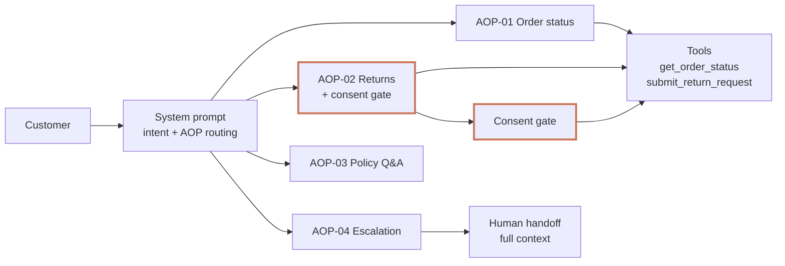

# Bookly AI Support Agent — Design

*Solutions Engineering Take-Home · Alastair Paterson · April 2026*

**Problem.** Bookly needs an AI support agent that handles order status, returns, and policy enquiries autonomously, and escalates payment disputes, account compromises, and high-value cases to a human every time.

## Architecture

Single-agent: four Agent Operating Procedures (AOPs) in the system prompt, two tools, a consent gate on the only mutating action. No router, no separate classifier — at this scope a router adds a classification error surface without benefit, and keeps the system prompt the single point of behavioural control for a CX owner.



Mock data lives in tool implementations; the system prompt defines behaviour only.

## Conversation design — answer / ask / act

- **Answer** — policy Q&A from enumerated facts; order data only after `get_order_status`.
- **Ask** — one question at a time when info is missing (order ID + email; item; reason).
- **Act** — `submit_return_request` requires explicit customer confirmation in the immediately preceding turn. Hard rule, not model discretion.

## Safety controls

- **Grounding.** Agent cannot state order/tracking data not returned by a tool call.
- **Consent gate (defence-in-depth).** Protected in two layers: system prompt forbids submission without explicit confirmation, and the tool independently rejects calls whose `customer_confirmation` argument is missing, non-affirmative, or not grounded in the customer's last turn — returns a structured `consent_gate_violation`. A prompt jailbreak alone cannot submit a return.
- **Human approval gate.** Payment disputes, account compromise, orders >£500, seller disputes — information access is itself gated, not just resolution.

## Example system prompt (excerpt — full prompt in `agent.py`)

```text
## AOP-02 — Returns
Sequence (one question at a time):
  1. Verify identity via get_order_status.  2. Ask which item if multiple.
  3. Ask reason briefly.                    4. Summarise the return.
  5. CONSENT GATE: ask for explicit confirmation. Wait for a clear yes.
  6. Only after explicit confirmation, call submit_return_request.
Rule: NEVER call submit_return_request without explicit customer confirmation
in the immediately preceding turn. Model confidence is irrelevant.

## Guardrails (hard — never override)
1. Never assert order/tracking data not returned by a tool call.
2. Never fabricate policy — use only the enumerated facts above.
3. Never call submit_return_request without explicit confirmation.
4. Never attempt to access payment or account-compromise data.
5. Never loop on an unresolvable issue — escalate once, clearly, and hold.
```

## What changes for production

Session store (Redis, keyed to authenticated user ID) · context-window management · structured logging with session IDs · output classifier as second guardrail layer · streaming responses · secrets manager · retry + circuit-breaking on real integrations · regression suite on adversarial and consent-bypass prompts · crawl → walk → run rollout (shadow → 10–50% → 80%+ with specialist sub-agents).

*Appendix (optional): AOP-02 sequence diagram, training data strategy, crawl/walk/run architecture, priority discovery questions, success metrics. Repo renders diagrams on GitHub.*
