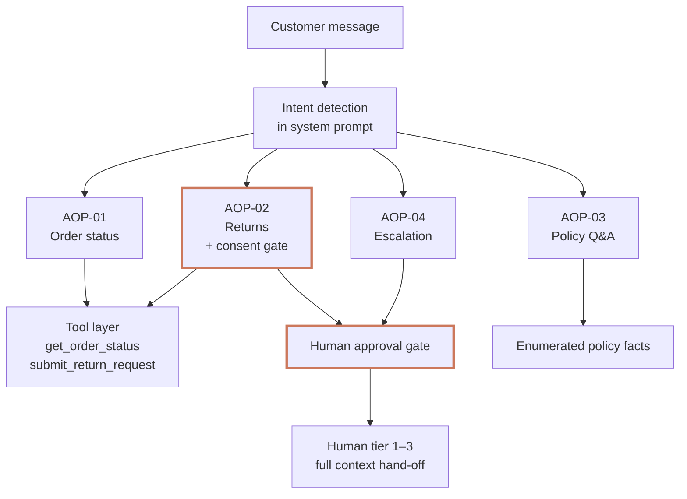

# Bookly AI Support Agent — Design

*Solutions Engineering Take-Home · Alastair Paterson · April 2026*

## Problem

Bookly needs an AI support agent that handles order status, returns, and policy enquiries autonomously, and escalates payment disputes, account compromises, and high-value cases to a human every time.

## 1. Architecture overview

Single-agent architecture. No router, no separate classifier. Four Agent Operating Procedures (AOPs) encoded in the system prompt, two tools, a human approval gate that sits across all AOPs.



**Why single-agent.** At this scope (three intents, two tools), a router adds a classification error surface without meaningful benefit. Lower latency, fewer failure modes, simpler to reason about. Prompt-based intent routing makes the system prompt the single point of behavioural control — iterable by a CX owner without an engineering ticket.

**Flow.** Customer message → prompt-driven intent match → AOP selected → tool call if required → tool result returned to model → grounded response to customer. Execution trace printed to console (stands in for backend observability).

**Separation of concerns.** Mock data lives in tool implementations; the system prompt defines behaviour only. Tools return data — the prompt never carries it.

## 2. Conversation & decision design

**Intent recognition.** Each AOP has an explicit trigger described in the system prompt (e.g. "customer asks about an order, delivery, tracking"). The model selects an AOP per turn based on the message.

**Answer / ask / act.** Three decisions per turn:

- **Answer** — policy Q&A grounded in enumerated facts, or tool-sourced order data.
- **Ask** — when required information is missing (order ID + email for AOP-01/02; item selection and reason in AOP-02) the agent asks one question at a time, not a bulleted form.
- **Act** — tool calls. `get_order_status` requires both order ID and email. `submit_return_request` requires an additional pre-condition: **explicit customer confirmation in the immediately preceding turn**. This consent gate is a hard rule, not model discretion — a premature submission at Bookly's scale is a material operational risk.

**Multi-turn sequencing (AOP-02 returns).** Identity → eligibility → item selection → reason → summary → consent gate → submission. Demonstrated end-to-end in `test_transcripts.md`.

## 3. Hallucination & safety controls

- **Grounding rule.** The agent cannot state order, tracking, or delivery data it has not retrieved via `get_order_status`. If the tool has not been called, the agent does not know — and says so. Enforced as rule #1 in the guardrail block.
- **Enumerated policy facts.** Returns window, shipping tiers, Prime pricing, payment methods are listed as ground truth in the prompt. Deviation is an error, not creativity.
- **Consent gate (defence-in-depth).** `submit_return_request` is protected in two places. (1) The system prompt forbids the model from calling it without explicit customer confirmation in the immediately preceding turn. (2) The tool implementation independently rejects any call whose `customer_confirmation` argument is missing, non-affirmative, or not grounded in the customer's most recent message — returning a structured `consent_gate_violation` error. A prompt jailbreak alone cannot submit a return; the tool-level check is the hard stop.
- **Human approval gate.** Gated data classes — payment disputes, account-compromise flags, orders over £500, marketplace seller data — are never retrieved. Escalation is architectural, not a capability limitation.
- **Email verification.** Every tool call verifies email against the order record; a mismatch returns an auth error the model surfaces honestly.
- **Escalation loop limit.** `MAX_TOOL_ROUNDS = 10`. If exceeded, the agent hands off to a human rather than looping.

## 4. Example system prompt (excerpt)

Full prompt in `agent.py`. The shape:

```text
You are Bea, the AI customer support agent for Bookly…
You are powered by four Agent Operating Procedures (AOPs). Follow them precisely.

## AOP-01 — Order status
Trigger: customer asks about an order, delivery, tracking.
Pre-conditions: collect order ID AND email in a single turn before calling get_order_status.
Rule: NEVER state order status, tracking, or delivery data you have not retrieved via
get_order_status. If the tool hasn't been called, you don't know.

## AOP-02 — Returns
Sequence (one question at a time):
  1. Verify identity via get_order_status.
  2. If multiple items, ask which to return.
  3. Ask the reason briefly.
  4. Summarise the return request.
  5. CONSENT GATE: ask for explicit confirmation. Wait for a clear yes.
  6. Only after explicit confirmation, call submit_return_request.
Rule: NEVER call submit_return_request without explicit customer confirmation in the
immediately preceding turn. Model confidence is irrelevant — this is a hard rule.

## AOP-04 — Escalation
Trigger: payment dispute, account compromise, high-value order, distress, request for human.
Behaviour: do NOT attempt to resolve. Do NOT call tools on the affected order —
information access is itself gated. Acknowledge, escalate, collect contact method.

## Guardrails (hard — never override)
1. Never assert order/tracking data not returned by a tool call.
2. Never fabricate policy details — use only facts above.
3. Never call submit_return_request without explicit customer confirmation.
4. Never attempt to access payment or account-compromise data.
5. Never loop on an unresolvable issue — escalate once, clearly, and hold.
```

AOP-03 (policy Q&A) and the persona / enumerated-facts blocks are omitted here for brevity; see `agent.py` for the complete prompt.

## 5. Production readiness — what would change

Shipped deliberately as a prototype. For production I would add:

- **Context window management.** History truncation + rolling summarisation; the current in-memory list grows unbounded.
- **Session store.** Redis keyed to authenticated user ID; replace in-process history.
- **Structured logging.** Session ID, AOP trigger, tool calls, tool results, latency — to a backend, not stdout.
- **Output classifier.** Second guardrail layer that checks the final response for PII leakage, policy deviation, and unverified assertions before it reaches the customer.
- **Streaming responses.** For perceived latency.
- **Input normalisation.** Unicode, email subaddressing, whitespace — currently only lower/strip.
- **Regression test suite.** Adversarial prompts, prompt-injection attempts, consent-gate bypass attempts, tool-argument fuzzing.
- **Secrets management.** Not `.env`; a secrets manager scoped to the deployment.
- **Retries and circuit-breaking on tool calls.** Current tools are in-process mocks; real integrations (Intercom, Salesforce, Stripe) need bounded retries and fail-closed behaviour.
- **Crawl → walk → run rollout.** Shadow mode first, then 10–50% live traffic, then 80%+ with expanded AOP coverage and specialist sub-agents. See appendix §3.

## Assumptions

The brief is deliberately open-ended. Nineteen explicit assumptions are documented in `DESIGN_APPENDIX.md` §1 — each is a discovery question where a different answer changes the design.

## Repo

| File | What it is |
|---|---|
| `agent.py` | Working Python CLI — Anthropic API, two tools, four AOPs |
| `README.md` | Run instructions and test flow table |
| `test_transcripts.md` | Four verified AOP flows with commentary |
| `DESIGN.md` | This document |
| `DESIGN_APPENDIX.md` | Assumptions, training data strategy, production architecture, metrics, commercial framing |

Screen recording attached separately.
