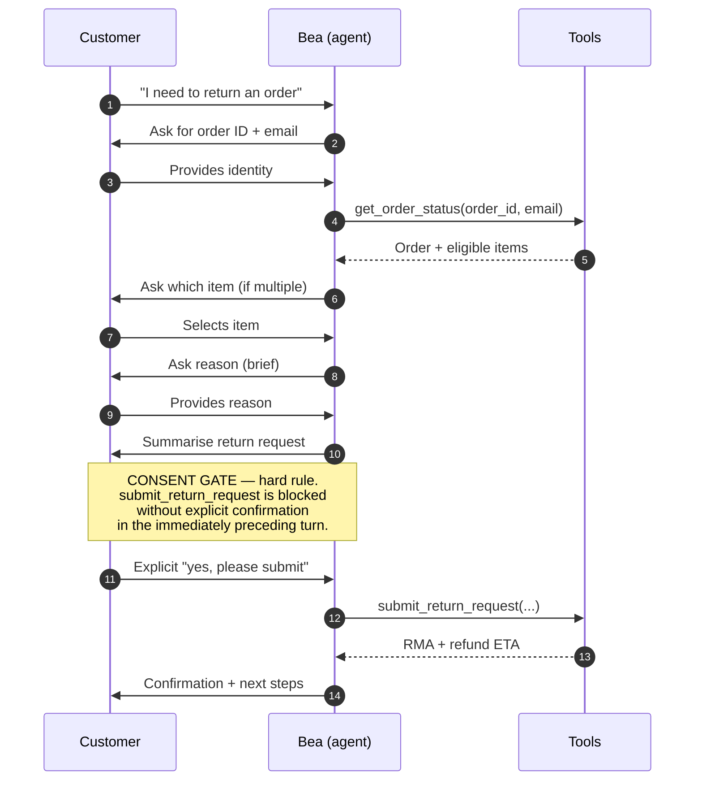

# Bookly AI Support Agent — Design Appendix

Optional depth for `DESIGN.md`: AOP-02 sequence, priority discovery questions, training data strategy, production architecture, success metrics.

## 1. AOP-02 returns — conversation sequence

The consent gate is the single guardrail an evaluator will probe hardest. It sits *after* identity, eligibility, item selection, reason, and summary, and *before* the only mutating tool call.

The consent gate is a precondition enforced as a hard rule in the system prompt, independent of model confidence. Every prior step is conversationally recoverable; only the final tool call is mutating, and only that call is gated.

## 2. Priority discovery questions (30-minute call)

Four assumptions carry the most architectural and commercial variance:

- **Scale & growth trajectory.** Monthly contact volume, peak-to-trough, geographic distribution. Sizes the future-state architecture: orchestrator + specialist sub-agents, Snowflake retrieval, caching, tiered model routing, fine-tuned specialist models.
- **Stakeholder balance.** Commercial buyer wants ROI, cost-per-contact, scale headroom, board-worthy deflection story. Technical buyer wants control, observability, guardrails, AOP ownership. Pitch and QBR narrative land both sides.
- **Top intents and "waste-of-time" share.** Password resets, shipping-ETA repeats, FAQ-equivalents. Highest-deflection lowest-risk land — pays for the deployment from week one and becomes the headline commercial metric.
- **Higher-risk flow volumes and SLA tiering.** Wholesale vs retail volume, known risk-flow share. Defines the specialist sub-agent roadmap and the medium-skill human + specialist pairing that realises the bulk of workforce savings without collapsing quality.

Full set of 19 assumptions — data/training, business/org, compliance, technical environment, intent distribution — available on request in a longer discovery document.

## 3. Training data strategy

A data-ingestion and labelling engagement, not a cold start. Decagon forward-deployed engineers + client internal engineers + third-party labelling partner.

- **Phase 1 — Ingest (weeks 0–3).** Resolved Jira tickets, CSAT signal, policy material into Snowflake. Catalogue top 20 intents split into waste-of-time category and core AOPs. Specify tool schemas. Output: v1 system prompt + first AOPs.
- **Phase 2 — Label + synthesise (weeks 3–6).** Third-party labellers work the Jira corpus under a taxonomy agreed with the CX lead. Generate a 500+ synthetic test corpus: happy path, edge cases, adversarial inputs, every escalation trigger, waste-of-time category. Becomes the regression suite.
- **Phase 3 — Live-corpus improvement (week 6+).** Every resolved conversation produces CSAT, escalation events, tool failures, confidence distributions, deflection rate, SLA compliance. Signal feeds AOP iteration (CX ops), confidence calibration (ML), specialist sub-agent fine-tuning, and Watchtower alerting.

## 4. Production architecture — the art of the possible

```mermaid
flowchart LR
    subgraph Crawl["Crawl · weeks 0–4"]
      C1[Single-agent · 4 AOPs · 2 tools]
      C2[Session store<br/>Redis / Postgres]
      C3[Input + output classifiers]
      C4[Structured logging<br/>streaming]
    end
    subgraph Walk["Walk · weeks 4–10"]
      W1[Orchestrator + specialist sub-agents<br/>returns · payments · wholesale · seller]
      W2[Snowflake retrieval]
      W3[Tiered model routing]
      W4[Agent Assist in<br/>Intercom + Salesforce]
    end
    subgraph Run["Run · weeks 10–20+"]
      R1[Fine-tuned specialist sub-agents]
      R2[Caching + CDN static policy]
      R3[A/B testing AOP variants]
      R4[Cross-channel · chat · email · voice]
    end
    Crawl --> Walk --> Run
```

- **Crawl — shadow and land.** Agent runs in shadow on live traffic. Go-live on the waste-of-time category first: highest deflection, lowest risk, cost reduction visible to the commercial buyer by end of week four.
- **Walk — controlled rollout.** Ramp to 10% then 50%. First specialist sub-agents go live in the Agent Assist layer for Tier 1 humans. Wholesale SLA routing enabled.
- **Run — enterprise-scale orchestration.** 80%+ inbound traffic. Orchestrator live; specialist sub-agents (returns, payments, seller-dispute, wholesale) activated. Caching + CDN for deterministic intents. Tiered model routing. Christmas pre-scaling mid-November.

The pairing of a medium-skill human with a specialist sub-agent in Agent Assist is where the bulk of workforce savings are realised — effective skill is multiplied, senior Tier 2 time is preserved for genuinely unusual cases.

## 5. Success metrics

- **Leading (daily).** Resolution rate per AOP, waste-of-time deflection rate (headline commercial metric), p50/p95 time to resolution, tool success + latency, cost per contact, cache hit rate.
- **Lagging (weekly).** CSAT, Tier 1 resolution share (medium-skill + specialist pairing closes without Tier 2), wholesale vs retail SLA compliance, escalation-decision quality, emerging intents not yet covered.
- **Commercial (monthly).** Uplift over ~30% incumbent baseline, labour cost per contact, hours redirected to higher-value work, specialist sub-agent contribution per flow.
- **Trust (quarterly — hard floors, target 0).** Grounding violation rate · consent gate violation rate · PII leakage rate. Non-negotiable: if any is non-zero, the AOP is paused, rolled back, rebuilt.

Commercial metrics are optimisation targets; trust metrics are hard constraints.
