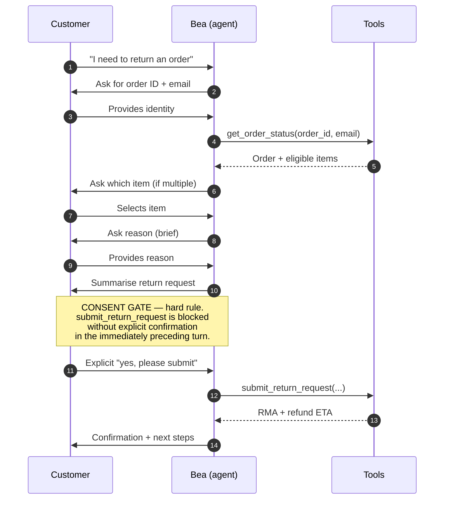

# Bookly AI Support Agent — Design Appendix

Supplementary material to `DESIGN.md`. Optional reading for evaluators who want depth on assumptions, training strategy, production architecture, and measurement.

## 1. Explicit assumptions

The brief is deliberately open-ended. Nineteen assumptions are embedded in the design. Each one is a discovery question in a real engagement. Where the answer differs, the design impact is stated.

### A. Data & training

- **A1 — Existing data available.** Assumed: readily accessible client data including good-quality internal technical documentation, resolved ticket history, and policy material — the ambition is to gather as much existing data as possible in the long run to drive best-case performance. Discovery: What is the completeness, freshness, and API accessibility of the corpus? Who owns it internally? Impact: good-quality existing data compresses Phase 1 sharply and delivers day-one baseline metrics; gaps get booked as follow-up working sessions rather than blocking launch.
- **A2 — Knowledge base format.** Assumed: a maintained product/policy KB plus well-labelled Jira tickets with resolution notes. Discovery: Label taxonomy, note completeness, resolution-quality signal? Impact: labelled Jira history is direct AOP training signal and a strong fine-tuning corpus for later-phase specialist sub-agents; absent labelling converts to a third-party labelling workstream, not a blocker.
- **A3 — Labelling operating model.** Assumed: human-led labelling strategy with a third-party labelling partner doing the volume work and Decagon forward-deployed engineers assisting on taxonomy, adjudication, and edge cases. Discovery: Preferred labelling vendor, throughput target, legal sign-off on internal comms as training signal? Impact: co-delivery labelling lets the client retain control of the taxonomy while Decagon accelerates time-to-first-AOP.
- **A4 — Ticket quality.** Assumed: overall ticket quality is usable and Jira notes are valuable training signal — with pockets of inconsistency to be surfaced and addressed collaboratively. Positive-first framing: the existing corpus is a strength; identified gaps are opportunities to schedule further discovery and working sessions with the client, which in turn deepens engagement. Discovery: CSAT at ticket level, agent performance data, known weak-coverage intents? Impact: a frank, optimistic read unlocks faster deployment and more productive follow-up meetings with the client team.

### B. Business & organisation

- **A5 — Company scale.** Assumed: enterprise scale, large and growing into very large — the SE engagement is sized accordingly. Discovery: Monthly contact volume, growth trajectory, peak-to-trough multiplier, geographic distribution? Impact: enterprise scale is what justifies — and funds — the full future-state architecture: a primary orchestrator agent with specialist sub-agents (returns, payments, wholesale, seller-dispute), a retrieval layer over Snowflake-backed knowledge, aggressive caching on high-volume deterministic intents, CDN-backed static policy serving for pure Q&A, tiered model routing (cheap/fast for classification, stronger for multi-turn, fine-tuned small models once data accumulates), and a full Agent Assist layer for the remaining human team. The art of the possible, not just the MVP, is what wins enterprise deals.
- **A6 — Stakeholder balance.** Assumed: a senior commercial buyer and a senior technical buyer share the decision. Commercial wants money, scale, flashy outcomes, headline deflection, brand lift, and a board-worthy story. Technical wants control, operational efficiency, reliability, and the ability to redirect their team onto high-value work while saving budget. Discovery: Who signs, who influences, what is each side's scorecard? Impact: the pitch, demo, and QBR narrative are built to land both sides simultaneously — commercial hooks (ROI, cost-per-contact, scale headroom, speed-to-value) woven with technical hooks (integration surface, observability, guardrails, own-your-AOPs). Neither side alone renews a multi-year enterprise deal.
- **A7 — AOP ownership and engagement goal.** Assumed: the engagement is explicitly about cost reduction, performance uplift, innovation capacity, and reducing dependence on low-skill repetitive labour — freeing the remaining human workforce for higher-value work. A CX ops or support-manager owner is assumed available to own AOP iteration. Discovery: Current cost per contact, team composition by skill tier, attrition rate in the low-skill layer? Impact: explicit cost-reduction and workforce-optimisation framing converts vague "efficiency" talk into a defensible ROI model; it also makes the workforce-transition conversation an open topic with HR partners early, not a surprise in month six.
- **A8 — Engineering resource.** Assumed: client internal engineers contribute as part of their role alongside Decagon and partner deployment teams — this is a co-delivery engagement, not managed service and not fully self-service. CRM-depth integrations can be Phase 2. Discovery: Internal sprint capacity, partner bench availability, competing priorities? Impact: co-delivery keeps the client team invested (critical for renewal) while Decagon forward-deployed engineers de-risk the complex pieces.
- **A9 — Timeline pressure.** Assumed: a commercial or board-level timeline exists — time pressure is actually the ideal condition, since it sharpens decision-making and compresses procurement cycles. A crawl-walk-run delivery model absorbs the pressure cleanly: crawl (shadow mode + top AOPs), walk (10–50% traffic), run (80%+ with expanded AOP coverage and sub-agents). Discovery: Launch date, board commitment, renewal-tied timeline? Impact: embrace time pressure as commercial momentum; protect deployment quality through the phased crawl-walk-run cadence rather than by slipping scope at the end.

### C. Compliance & data

- **A10 — Regulatory environment.** Assumed: standard e-commerce — GDPR applies, no sector-specific regulation. Decagon operates under a clear established legal framework that covers standard enterprise deployments, which is itself a commercial advantage against less mature competitors. Discovery: Industry-specific overlays — PCI-DSS scope on the payments surface, any data-residency constraints beyond EU? Impact: Decagon's legal framework handles the base case out of the box; sector overlays are well-trodden with existing playbooks.
- **A11 — PII in responses.** Assumed: customer PII is not surfaced in agent responses — only used for verification. Discovery: What customer data does the agent need to resolve common issues? Impact: if PII surfaces in responses, output PII scrubbing becomes mandatory.
- **A12 — Data retention.** Assumed: conversation logs retained for QA and training. Discovery: Data retention policy for customer support interactions? Impact: short retention limits the training pipeline and continuous improvement loop.

### D. Technical environment

- **A13 — Greenfield vs replacement.** Assumed: a basic incumbent chatbot delivering around 30% deflection — this is the baseline to exceed, and exceed decisively. Discovery: Incumbent platform, its failure modes, customer-perception of the current bot, migration constraints? Impact: 30% is a quantifiable baseline for the ROI model; the lift from ~30% to the 60–70% range of comparable Decagon deployments is the single cleanest commercial story available.
- **A14 — Existing support stack.** Assumed: mature, well-architected stack — Intercom for ticketing and chat, Salesforce for customer records, Snowflake for analytics and unified data. Discovery: API access, refresh cadence, authentication model (SSO/OAuth), data-governance model? Impact: mature stack dramatically accelerates Phase 1; Intercom and Salesforce have established Decagon connectors, and Snowflake as the unified data layer makes the retrieval/fine-tuning pipeline straightforward to stand up.
- **A15 — Primary channels.** Assumed: chat and email primary; voice is future-state. Discovery: Chat, email, phone, social — volume by channel? Impact: high phone volume makes voice deployment a Phase 1 requirement, increasing complexity.
- **A16 — Language.** Assumed: English only. Discovery: Multiple languages served? Impact: multi-language requires translation quality validation, per-language AOP testing, and separate confidence calibration.

### E. Contact intent distribution

- **A17 — Intent distribution.** Assumed: order status, returns, and policy Q&A are the bulk of volume — and alongside them sits a substantial long tail of low-value "waste of time" interactions: password resets, "has my order shipped yet" repeat queries, shipping-ETA pings, navigation help, FAQ-equivalent questions, duplicate enquiries across channels. Discovery: Top 10 contact reasons by volume and what share of total is effectively waste-of-time contact? Impact: the waste-of-time category is the single most compelling land — highest deflection, lowest risk, immediate cost reduction, and the clearest demonstration to the commercial buyer that the agent is paying for itself from week one.
- **A18 — Higher-risk interactions and SLA tiering.** Assumed: higher-risk tickets route to a medium-skill human paired with a specialist in-the-loop sub-agent (returns specialist, payments specialist, seller-dispute specialist) rather than directly to a senior handler — the pairing multiplies the workforce and keeps senior time for genuinely unusual cases. Wholesale and enterprise book buyers receive a separate, tighter SLA tier distinct from retail customers. Discovery: Current SLA tiers by customer class, wholesale share of revenue, known risk-flow volumes? Impact: the medium-skill-plus-specialist-agent pattern is how cost savings get realised without collapsing quality; tiered SLAs for wholesale protect the highest-margin customers and are an explicit commercial hook.
- **A19 — Volume seasonality and payments surface.** Assumed: EMEA-led demand. Primary peak is Christmas (not Black Friday), with secondary spikes on major book release days. Payments surface is likely Stripe with a bespoke custom front-end. Discovery: Historical peak-to-trough ratio, 2026 release-day calendar, Stripe integration depth, custom-checkout edge cases? Impact: pre-scaling targets Christmas and release-day spikes specifically; Stripe is a well-trodden Decagon integration; the custom front-end requires a deliberate UI handshake but is standard engineering work.

### Priority for a 30-minute discovery call

Four questions carry the most architectural and commercial variance: A5 (enterprise scale and growth trajectory — sizes the future-state architecture), A6 (stakeholder balance between commercial and technical buyers — shapes the pitch), A17 (top contact reasons and the waste-of-time share — sizes the Phase 1 ROI story), A18 (higher-risk flow volume and wholesale SLA tiering — defines the specialist sub-agent roadmap). Everything else flows from these four answers.

## 2. Training data strategy

This is a data-ingestion and labelling engagement, not a cold-start. Good-quality client data exists across Jira, Intercom, Salesforce, and Snowflake — the job is to mobilise it quickly and turn it into AOP, sub-agent, and regression signal.

### Phase 1 — Ingest the existing corpus (weeks 0–3)

Decagon forward-deployed engineers work alongside the client's internal engineers and a third-party labelling partner:

- Pull resolved Jira tickets with their labels, resolution notes, and CSAT signal from Intercom and Salesforce; unify into Snowflake-backed retrieval.
- Extract structured policy material from internal tech documentation into a canonical policy document owned by the CX lead — this becomes AOP-03 ground truth and seeds the CDN-served static-policy cache.
- Catalogue the top 20 intents by volume, split into the waste-of-time deflection category (password resets, shipping-ETA repeats, FAQ-equivalents) and the core AOP category (order status, returns, policy, payments, seller-dispute, wholesale).
- Specify tool schemas for every data source the agent needs to call.

Output: an indexed labelled ticket corpus, a canonical policy document, a ranked intent list with volume estimates, and tool specs. Used directly to produce the v1 system prompt and first AOPs.

### Phase 2 — Labelling and synthetic augmentation (weeks 3–6)

- Third-party labellers work the Jira corpus under a taxonomy agreed with the CX lead; Decagon forward-deployed engineers assist with taxonomy refinement and edge-case adjudication.
- Generate a synthetic test corpus of 500+ conversations covering: happy path per AOP, edge cases (malformed order IDs, mismatched email, extenuating circumstances), adversarial inputs (prompt injection, social engineering), every escalation trigger (payment dispute, account compromise, wholesale-specific, seller-dispute), and the full waste-of-time category.
- Each case labelled with expected agent behaviour. This becomes the regression suite — every AOP iteration runs against it before promotion.

### Phase 3 — Live-corpus continuous improvement (week 6+)

Every resolved conversation produces signal:

- Explicit CSAT response (where captured)
- Escalation events — what triggered, was it appropriate, did the medium-skill human + specialist sub-agent pairing resolve at Tier 1?
- Tool failures and latencies
- Confidence-band distribution per intent
- Waste-of-time deflection rate (the headline commercial metric)
- Wholesale vs retail SLA compliance

Training signal feeds four places: AOP iteration (CX ops), confidence calibration (ML), specialist sub-agent fine-tuning (ML + Decagon), and Watchtower alerting (ops). The system improves every week it is in production.

## 3. Confidence scoring

| Band | Threshold | Behaviour |
|---|---|---|
| High | >0.85 | Respond directly. Log and sample for QA. |
| Medium | 0.60–0.85 | Ask one clarifying question before acting. |
| Low | 0.40–0.60 | Acknowledge uncertainty. Offer clarification or human handoff. |
| Very low | <0.40 | Escalate immediately. Do not attempt resolution. |

Two principles:

- The threshold for consequential actions (return submission, data access, wholesale-account changes) is higher than for informational responses.
- The consent gate in AOP-02 and the human approval gate for gated data classes operate independently of confidence scoring — they are hard stops regardless of model certainty.

In the prototype, confidence behaviour is implicit in the AOP rules. Production makes it explicit: returning structured confidence per response, calibrating per-intent, A/B-testing threshold adjustments, and — at enterprise scale — training specialist sub-agents whose confidence distributions can be tuned independently per flow.

## 4. AOP-02 returns — conversation sequence

The consent gate is the single guardrail an evaluator will probe hardest. The full sequence below shows where it sits relative to every other step — it is a hard stop that sits *after* identity, eligibility, item selection, reason, and summary, and *before* the mutating tool call.

Two properties of this sequence matter architecturally. First, the consent gate is not a model-discretion check — it is a precondition enforced in the system prompt as a hard rule, independent of model confidence. Second, every prior step is recoverable: a mistaken item selection or malformed reason is a conversational correction, not an operational incident. Only the final tool call is mutating, and only that call is gated.

## 5. Three-tier escalation model

**Tier 1 — Medium-skill human + specialist sub-agent.** The workforce-optimisation layer. A medium-skill human operator is paired with an Agent Assist layer that invokes a specialist sub-agent for the relevant flow (returns specialist, payments specialist, seller-dispute specialist, wholesale-account specialist). The pairing multiplies the human's effective skill — they resolve cases that would previously have needed Tier 2, without the cost. This is where the bulk of the workforce savings are realised.

**Tier 2 — Senior specialist human.** Policy exceptions, complex disputes, unusual wholesale/enterprise cases, and edge cases the Tier 1 pairing cannot close. Sees the same context package plus Tier 1's notes and the specialist sub-agent's trace.

**Tier 3 — Management or legal.** Legal threats, regulatory concerns, executive escalations, potential brand risk. Marketplace seller disputes land here immediately when third-party liability is in play.

Wholesale and enterprise book buyers receive a separate, tighter SLA tier distinct from retail — enforced in the routing layer so these customers skip retail queueing and reach the appropriate tier faster.

What the human receives at handoff:

- Full conversation history
- AOP execution trace — which AOP fired, at which step it escalated, which specialist sub-agent (if any) ran
- Confidence score at point of escalation
- Tool call results already retrieved
- Categorised escalation reason
- Customer class (retail / wholesale / enterprise) for SLA routing
- Agent Assist: AI-suggested resolution path
- Per-flow specialist sub-agent recommendation where applicable

The customer never repeats themselves.

## 6. Production architecture — the art of the possible

The prototype is a single-process CLI with a single model and two tools. At enterprise scale the target architecture is substantially richer. Listed by deployment phase (crawl → walk → run) rather than priority.

```mermaid
flowchart LR
    subgraph Crawl["Crawl · weeks 0–4"]
      direction TB
      C1[Single-agent CLI<br/>4 AOPs · 2 tools]
      C2[Session store<br/>Redis / Postgres]
      C3[Input + output<br/>classifiers]
      C4[Structured logging<br/>streaming responses]
    end
    subgraph Walk["Walk · weeks 4–10"]
      direction TB
      W1[Orchestrator +<br/>specialist sub-agents<br/>returns · payments ·<br/>wholesale · seller]
      W2[Snowflake<br/>retrieval layer]
      W3[Tiered model routing]
      W4[Agent Assist in<br/>Intercom + Salesforce]
    end
    subgraph Run["Run · weeks 10–20+"]
      direction TB
      R1[Fine-tuned per-flow<br/>specialist sub-agents]
      R2[Caching + CDN-served<br/>static policy]
      R3[A/B testing AOP<br/>variants in production]
      R4[Cross-channel<br/>chat · email · voice]
    end
    Crawl --> Walk --> Run
```

### Crawl — production-ready foundations

- Authenticated session layer with Redis or Postgres session store keyed to authenticated user ID, with TTL and recovery. The prototype's in-memory conversation history is a demo convenience; it does not survive restart or concurrent sessions.
- Input and output classifiers as a second guardrail layer. Input classifier flags prompt injection, social engineering, obvious out-of-scope. Output classifier validates responses before delivery for PII leakage, policy fabrication, unsafe content.
- Streaming responses — perceived latency drops sharply with first-token-under-300ms.
- Structured logging with session and user IDs as primary keys — the durable observability layer that makes the "transparent observability" claim real.
- Context-window management: sliding-window truncation plus periodic summarisation of older turns into a persistent running summary.
- Rate limiting with exponential backoff + jitter, circuit breaker at the API client layer.
- Secrets management via AWS Secrets Manager or HashiCorp Vault, with rotation.

### Walk — enterprise-scale orchestration

- Multi-agent architecture — a primary orchestrator routes to specialist sub-agents per flow (returns, payments, wholesale, seller-dispute, policy Q&A), each with its own confidence calibration and tool set.
- Retrieval layer over Snowflake — the unified data layer already in place — for grounded policy, order, and historical-ticket context.
- Aggressive caching on high-volume deterministic intents: identical password-reset and shipping-ETA queries hit cache rather than the LLM, driving cost per contact sharply down.
- CDN-backed static policy serving for pure Q&A — fastest possible response, zero LLM cost.
- Tiered model routing: cheap/fast model for intent classification and simple Q&A; stronger model for multi-turn and higher-stakes flows; fine-tuned smaller models for high-volume repetitive intents as training data accumulates.
- Agent Assist layer for the remaining human team — specialist sub-agent traces surfaced directly in the Intercom + Salesforce console.

### Run — continuous optimisation

- Fine-tuned per-flow specialist sub-agents trained on the labelled Jira corpus plus live traffic.
- A/B testing of AOP variants, confidence thresholds, and prompt versions in production.
- Automated AOP regression suite on every promotion.
- Cross-channel unification (chat, email, voice) with shared session state.

## 7. Success metrics

### Leading indicators (daily)

- Resolution rate overall and by AOP
- Waste-of-time deflection rate — the headline commercial metric
- Median and 95th-percentile time to resolution
- Tool call success rate and latency
- Cost per resolved contact
- Cache hit rate on deterministic intents

### Lagging indicators (weekly)

- CSAT (post-conversation survey, sampled)
- Tier 1 resolution share — how many cases the medium-skill + specialist sub-agent pairing closes without needing Tier 2
- Wholesale/enterprise SLA compliance vs retail
- Human escalation quality (did the Tier 1 operator agree with the escalation decision)
- Voice of Customer themes — emerging intents not covered by existing AOPs

### Commercial and workforce indicators (monthly)

- Uplift over the ~30% incumbent-chatbot baseline
- Labour cost per contact trend
- Hours of human time redirected to higher-value work
- Specialist sub-agent contribution per flow

### Trust metrics (quarterly, hard floors)

- Grounding violation rate (responses asserting data not returned by tools) — target 0
- Consent gate violation rate (returns submitted without confirmation) — target 0
- PII leakage rate — target 0

The trust metrics are non-negotiable. If any is non-zero for a sustained period, the AOP is paused, rolled back, and rebuilt. Commercial metrics are optimisation targets; trust metrics are hard constraints.

## 8. Deployment phasing — crawl, walk, run

**Crawl — shadow and land (weeks 0–4).** Agent runs in shadow mode in parallel to human agents on live traffic; responses compared against human resolution for quality. Go-live on the waste-of-time category first (password resets, shipping-ETA repeats, FAQ-equivalents) — highest deflection, lowest risk, immediate cost reduction visible to the commercial buyer by end of week four.

**Walk — controlled rollout with specialist sub-agents (weeks 4–10).** Ramp to 10% then 50% of inbound traffic. First specialist sub-agents (returns, policy Q&A) go live in the Agent Assist layer for Tier 1 humans. Wholesale SLA routing enabled. Daily review of escalations and tool failures; weekly AOP iteration.

**Run — enterprise-scale orchestration (weeks 10–20).** Ramp to 80%+ of inbound traffic. Multi-agent orchestrator live; additional specialist sub-agents (payments, seller-dispute, wholesale) activated. Caching and CDN layers deployed for deterministic intents. Tiered model routing activated. Christmas pre-scaling complete by mid-November; major book-release-day capacity validated against expected 2026 release calendar.

**Scale — continuous improvement (ongoing).** Weekly AOP iteration. Monthly confidence calibration review. Quarterly strategic review with both commercial and technical buyers. Per-flow specialist sub-agent fine-tuning on accumulating live corpus. New AOP coverage expanded as intent volume justifies.

## 9. What I would change with more time

### Code

- Streaming responses for perceived latency reduction
- Structured logging with session IDs instead of console prints
- Output classifier as a second guardrail layer
- Context-window management with periodic summarisation
- Input normalisation (Unicode, subaddressing like `alex+bookly@example.com`)

### Architecture

- Authenticated session layer with Redis store
- Confidence scoring made explicit and measurable rather than implicit in AOP behaviour
- Intent classifier as an edge filter before the AOP layer
- Stubbed multi-agent orchestrator to demonstrate specialist sub-agent handoff
- Mock retrieval layer reading from a local policy JSON to model the Snowflake retrieval pattern

### Evaluation

- Regression suite target of 500+ cases covering adversarial inputs, prompt injection, and every escalation trigger
- Labeller disagreement analysis on edge cases
- Synthetic adversarial conversation generation at scale

### Training data

- Structured Phase 1 ingestion pipeline reading Jira labels + notes from the existing Intercom / Salesforce / Snowflake stack
- Quality filter for the resolved-ticket corpus
- Labelling pipeline with third-party labellers plus Decagon taxonomy adjudication

## 9. What I deliberately did not do

- **No web UI.** A working CLI demonstrating the architecture cleanly is more valuable than a polished interface that does not.
- **No breadth at the expense of depth.** Four AOPs done correctly beats ten done shallowly. The enterprise future-state is described in section 5 rather than half-built in the prototype.
- **No all-in-one agentic platform.** The implementation calls the Anthropic API directly, orchestrates tool calls manually, and manages conversation state explicitly. The architecture is visible to the evaluator.
- **No fake audit-line narration in the system prompt.** In a real Decagon deployment, observability logs go to a backend — customers do not see them. The prototype mirrors that separation: the console log is the execution trace.
- **No overclaiming on metrics.** The 60–70% comparable-deployment resolution figure is Decagon's published case-study data, framed explicitly as "comparable deployments." The ~30% incumbent baseline is the assumption to be validated in discovery. Projections specific to Bookly's exact volume, cost per contact, and workforce savings require the discovery conversation.
